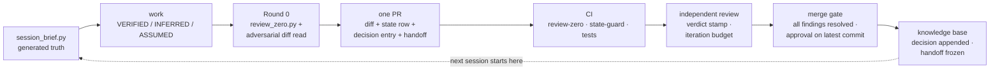

# Agentic SDLC — a governance framework for production systems built by AI agents

A working skeleton for running **multiple AI coding agents against a critical production
codebase** without losing control of what is true, what was decided, and what has actually been
verified.

This is not a prompt collection and not an agent framework. It is the **governance layer** that
sits above whichever agents you use — the documents, contracts, and CI gates that make agent
output reviewable, attributable, and safe to merge.

---

## The problem it solves

A single agent on a toy repo needs no governance. The failure modes appear at the intersection of
three things:

1. **Production consequences** — a wrong change costs money, data, or trust, and the worst ones
   fail *silently*.
2. **Multiple agents** — different models, different vendors, different sessions, no shared
   memory, each arriving with full confidence and zero context.
3. **Continuous change** — the system moves faster than any human can personally verify.

At that intersection, four things break in a predictable order:

| Failure | What it looks like |
|---|---|
| **Context rot** | Hand-maintained docs drift from reality. Agents cite them confidently. The docs become an active liability — worse than none, because they are *trusted*. |
| **Confident falsehood** | An agent produces a fluent, plausible, wrong answer. It passes review because it sounds right to the reviewer too. |
| **Silent scope creep** | "While I was in there I also fixed…" — unreviewable diffs mixing concerns, where the risky change hides behind the useful one. |
| **Decision amnesia** | A decision is made, implemented, and forgotten. Six weeks later another agent reverses it with equal confidence and no idea it was ever settled. |

Every mechanism in this repo exists to prevent one of those four.

---

## The five core ideas

### 1. A constitution, not a manual

One short, stable, **tool-neutral** document (`CLAUDE.md`, aliased by `AGENTS.md`) that contains
*only* routing, authority, and non-negotiable rules. It does not contain runbooks, architecture,
or current state — those rot at a different rate and live elsewhere.

It has an **amendment rule**: it changes only with the Owner's approval and a new entry in the
decision log. That is what makes it citable six months later.

> **Why tool-neutral matters.** The moment you have two agent vendors, per-tool instruction files
> guarantee drift. One canonical file, with thin per-tool entry points pointing at it, means every
> agent is governed by the same text.

### 2. Documents separated by volatility, not by topic

The usual instinct is to organize docs by subject. That is wrong here. Organize by **how fast the
content goes stale** and **who is authoritative for it**:

| Layer | Rate of change | Rule |
|---|---|---|
| **Constitution** | Almost never | Amendment requires approval |
| **Decision log** | Append-only | Never rewritten; a reversal is a *new* entry naming what it supersedes |
| **State ledger** | Days | TTL-stamped, size-budgeted, CI-enforced; points, never narrates |
| **Reference hubs** | Weeks | The "how the machinery works" layer |
| **Session handoffs** | Per session | Immutable evidence records |
| **Archive** | Never | Explicitly read-only and never current |

Mixing volatility layers is what produces a 30,000-token document nobody can read and everybody
cites.

### 3. Generate live state; hand-write only intent

**Any fact that can be derived should be derived at read time, not mirrored by hand.**

Hand-maintained mirrors of live state rot silently and measurably. In the system this was
extracted from, one audit found the majority of hand-written cross-references had gone stale.
The fix was to replace "read the state doc first" with "run the state *script* first" —
`scripts/session_brief.py` derives repo tip, migration head, open PRs, and doc freshness live,
then points at the small hand-written surfaces that remain authoritative for *intent*.

Humans and agents hand-write **decisions and intent**. Everything else is generated.

### 4. Evidence grammar — claims carry their provenance

Every claim goes in one of three bins, **labeled in the deliverable itself**:

- **VERIFIED** — you looked; you can cite `file:line`, a query, or a command output.
- **INFERRED** — follows from verified facts by reasoning you state.
- **ASSUMED** — you need it true and have not checked. Ships with its blast radius attached.

Consequential claims additionally carry a machine-greppable stamp:

```
<claim> · STATUS: CANDIDATE|VALIDATED|REJECTED · evidence: <path>
```

A claim with no evidence path is not actionable — including the agent's own. See
[`docs/reference/evidence-grammar.md`](docs/reference/evidence-grammar.md).

### 5. Review is a contract, not a vibe

- **Round 0** — the author self-reviews their own full diff as an adversary *before* pushing.
  Half of it is mechanical ([`scripts/review_zero.py`](scripts/review_zero.py)); half cannot be
  scripted and is still mandatory.
- **An independent reviewer is required on every PR**, including PRs authored by the reviewer's
  own vendor.
- **A verdict comment is mandatory on every review, even a clean one** — otherwise a clean PR is
  indistinguishable from one nothing reviewed.
- **A well-evidenced author rebuttal closes a thread.** Reviewers are advisory; evidence wins.
- **Reviewers review the code that is there, not the code they would have written.** A reviewer
  that taxes novelty trains the author out of it.
- **An iteration budget** with a tripwire — if round 4 shows a flat finding count, the problem is
  structural; stop iterating and decompose.

See [`docs/reference/review-contract.md`](docs/reference/review-contract.md).

---

## The shape of one change



Every artifact in that loop is a file in the repo. Nothing load-bearing lives in chat: a session
that ends leaves its evidence exactly where the next agent — a different model, a different
vendor, zero shared memory — begins.

---

## The part people underestimate: the craft layer

The documents above tell an agent *what is true and what it may do*. They do not teach it *how to
work*. That is [`docs/reference/agent-operating-manual.md`](docs/reference/agent-operating-manual.md)
— the longest and, in practice, the highest-leverage document here.

It has two halves, and a session running only one of them fails predictably:

- **The defensive half** — verify by re-deriving rather than recognizing; rank risk by *how
  silently it fails*; attack your own conclusion before handing it over.
- **The generative half** — rigor with nothing to be rigorous *about* is a very careful way of
  adding nothing. Where new ideas actually come from, and how to price one before pitching it.

It closes with two failure taxonomies that are, for most teams, the immediately useful part:

- **The mistakes that look like competence** — fluent summary of unread code; speed worn as
  diligence; the option survey instead of a recommendation; green CI as proof.
- **The mistakes that look like caution** — asking when you could look; the minimum defensible
  action; filing instead of thinking; hedging a conclusion you actually verified.

---

## What's in this repo

```
CLAUDE.md                                  The constitution template
AGENTS.md                                  Tool-neutral entry point (points at the constitution)
ADOPTION.md                                How to adopt incrementally — read this second
CONTRIBUTING.md                            The bar for changes to the framework itself
docs/
  DECISIONS.md                             Append-only decision log + entry contract
  STATE.md                                 Volatile state ledger + freshness contract
  handoffs/TEMPLATE.md                     Session evidence record
  archive/                                 Read-only history — never current
  reference/
    agent-operating-manual.md              The craft layer
    review-contract.md                     Review gates, verdict stamps, iteration budget
    evidence-grammar.md                    VERIFIED/INFERRED/ASSUMED + status stamps
.github/
  agent-review-guidelines.md               Standing invariants; steers automated reviewers
  PULL_REQUEST_TEMPLATE.md                 Round-0 checklist + iteration tally
  ISSUE_TEMPLATE/truth_gap.md              For source-of-truth contradictions
  ISSUE_TEMPLATE/backlog_item.md
  workflows/state-guard.yml                Enforces write-with-the-work
  workflows/review-zero.yml                Runs the mechanical pre-push gate in CI
scripts/
  session_brief.py                         Generated session-start read
  review_zero.py                           Mechanical half of Round-0 self-review
  librarian.py                             Daily doc freshness / link / orphan / budget pass
```

Every template is written to be **adopted and edited**, not read and admired. Placeholders are
marked `<LIKE THIS>`.

---

## Honest limitations

- **This is extracted from one system.** It was developed running several agent vendors against a
  production-consequence Python/Postgres platform over roughly a year. It is not a survey of
  industry practice, and it has not been validated across many teams.
- **It assumes a human Owner with final authority.** The whole model — approvals, verdicts,
  amendment rights — collapses into bureaucracy without one accountable person.
- **The overhead is real and is only worth paying above a threshold.** For a solo project with one
  agent and reversible changes, most of this is cost with no benefit. See
  [`ADOPTION.md`](ADOPTION.md) for what to adopt first and what to skip.
- **The scripts are reference implementations** — standard library only, Python 3.10+,
  deliberately lightly scoped. They are meant to be forked and extended with checks mined from
  *your* review history, not used as-is.

---

## Getting started

1. Read [`ADOPTION.md`](ADOPTION.md) — it gives a staged path rather than an all-at-once install.
2. Copy `CLAUDE.md` and `AGENTS.md` to your repo root; fill the `<PLACEHOLDERS>`.
3. Start `docs/DECISIONS.md` with your next real decision. Do not backfill history.
4. Add `state-guard.yml` only once the state ledger is genuinely being used.

---

## Contributing

[`CONTRIBUTING.md`](CONTRIBUTING.md) has the details. The short version: every mechanism here must
name the silent failure it prevents — additions and deletions alike are judged by that bar — and
this repo runs its own gates, so your PR will meet `review-zero` and `state-guard` on the way in.

---

## License

[MIT](LICENSE). The templates are intended to be copied, modified, and adapted freely — that is
the point of publishing them.
