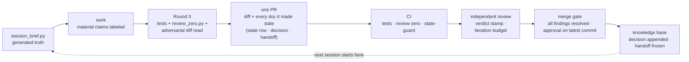

# Agentic SDLC — a governance framework for production systems built by AI agents

A working skeleton for running **multiple AI coding agents against a critical production
codebase** without losing control of what is true, what was decided, and what has actually been
verified.

This is not a prompt collection and not an agent framework. It is the **governance layer** that
sits above whichever agents you use — the documents, contracts, tests, and CI gates that make agent
output reviewable, attributable, and safe to merge.

## Install Stage 1 into an existing repo

```bash
git clone https://github.com/metafive-ai/agent-constitution.git
python agent-constitution/scripts/bootstrap.py --dest /path/to/your/repo
```

That copies the constitution, decision log, issue templates, and scripts. Existing files are left
alone unless you pass `--force`. Then:

1. Fill every `<PLACEHOLDER>` in `CLAUDE.md`. Keep it under ~150 lines.
2. Start `docs/DECISIONS.md` with your **next real decision**. Do not backfill history.
3. `gh label create truth-gap --color B60205 --description "Two sources of truth disagree"`
4. `python scripts/session_brief.py`

`--stage 2|3|4` adds the later layers. Read [`ADOPTION.md`](ADOPTION.md) before turning CI gates on.
A solo project with one agent and reversible changes should skip this repo.

---

## The problem it solves

A single agent on a toy repo needs no governance. The failure modes appear at the intersection of
three things:

1. **Production consequences** — a wrong change costs money, data, or trust, and the worst ones
   fail *silently*.
2. **Multiple agents** — different models, different vendors, different sessions, no shared
   memory, each arriving with full confidence and zero context.
3. **Continuous change** — the system moves faster than any human can personally verify.

At that intersection, four things break in a predictable order:

| Failure | What it looks like |
|---|---|
| **Context rot** | Hand-maintained docs drift from reality. Agents cite them confidently. The docs become an active liability — worse than none, because they are *trusted*. |
| **Confident falsehood** | An agent produces a fluent, plausible, wrong answer. It passes review because it sounds right to the reviewer too. |
| **Silent scope creep** | "While I was in there I also fixed…" — unreviewable diffs mixing concerns, where the risky change hides behind the useful one. |
| **Decision amnesia** | A decision is made, implemented, and forgotten. Six weeks later another agent reverses it with equal confidence and no idea it was ever settled. |

Every mechanism in this repo exists to prevent one of those four.

---

## The five core ideas

### 1. A constitution, not a manual

One short, stable, **tool-neutral** document (`CLAUDE.md`, aliased by `AGENTS.md`) that contains
*only* routing, authority, and non-negotiable rules. It does not contain runbooks, architecture,
or current state — those rot at a different rate and live elsewhere.

The filename is not a statement that Claude has special authority. `CLAUDE.md` is canonical here
because some tools auto-discover that filename; the **content and authority are vendor-neutral**.
Thin entry points such as `AGENTS.md` point at the same constitution rather than duplicating it.
Rename the canonical file only after verifying that every target agent reliably follows the
indirection — discovery behavior is part of the safety contract, not cosmetic naming.

It has an **amendment rule**: it changes only with the Owner's approval and a new entry in the
decision log. That is what makes it citable six months later.

### 2. Documents separated by volatility, not by topic

The usual instinct is to organize docs by subject. That is wrong here. Organize by **how fast the
content goes stale** and **who is authoritative for it**:

| Layer | Rate of change | Rule |
|---|---|---|
| **Constitution** | Almost never | Amendment requires approval |
| **Decision log** | Append-only | Never rewritten; a reversal is a *new* entry naming what it supersedes |
| **State ledger** | Days | TTL-stamped, size-budgeted, CI-enforced; points, never narrates |
| **Reference hubs** | Weeks | The "how the machinery works" layer |
| **Session handoffs** | Per session | Immutable evidence records |
| **Archive** | Never | Explicitly read-only and never current |

Mixing volatility layers is what produces a 30,000-token document nobody can read and everybody
cites.

### 3. Generate live state; hand-write only intent

**Any fact that can be derived should be derived at read time, not mirrored by hand.**

Hand-maintained mirrors of live state rot silently and measurably. In the system this was
extracted from, one audit found the majority of hand-written cross-references had gone stale.
The fix was to replace "read the state doc first" with "run the state *script* first" —
`scripts/session_brief.py` derives repository state, open-PR context, current-branch CI when an open
PR exists, migration head, and document freshness live, then points at the small hand-written
surfaces that remain authoritative for *intent*.

Humans and agents hand-write **decisions and intent**. Everything else is generated when practical.

### 4. Evidence grammar — material claims carry provenance

Material claims — claims whose truth could change a decision or action — go in one of three bins,
**labeled in the deliverable itself**:

- **VERIFIED** — you looked; you can cite `file:line`, a query, or a command output.
- **INFERRED** — follows from verified facts by reasoning you state.
- **ASSUMED** — you need it true and have not checked. Ships with its blast radius attached.

Ordinary connective prose does not need audit markup. Uniform labeling destroys the signal the
labels exist to preserve.

Consequential claims that outlive the session additionally carry a machine-greppable stamp:

```
<claim> · STATUS: CANDIDATE|VALIDATED|REJECTED · evidence: <path>
```

See [`docs/reference/evidence-grammar.md`](docs/reference/evidence-grammar.md).

### 5. Review is a contract, not a vibe

- **Round 0** — the author self-reviews their own full diff as an adversary *before* pushing.
  The deterministic half is regression tests plus
  [`scripts/review_zero.py`](scripts/review_zero.py); the judgment half cannot be scripted and is
  still mandatory.
- **An independent reviewer is required on every PR**, including PRs authored by the reviewer's
  own vendor.
- **A verdict comment is mandatory on every review, even a clean one** — otherwise a clean PR is
  indistinguishable from one nothing reviewed.
- **An evidence-backed author rebuttal can resolve a finding for iteration accounting.** It does
  **not** manufacture the independent reviewer's green light on the latest commit.
- **Reviewers review the code that is there, not the code they would have written.** A reviewer
  that taxes novelty trains the author out of it.
- **An iteration budget** with a tripwire — if round 4 shows a flat finding count, the problem is
  structural; stop iterating and decompose.

See [`docs/reference/review-contract.md`](docs/reference/review-contract.md).

---

## The mechanical gate is impact-aware

"Added lines only" is useful for local semantic checks because pre-existing debt must not block an
unrelated PR. It is **not** sufficient for referential integrity.

`review_zero.py` therefore uses two scopes:

- **Added-line checks** for newly introduced malformed stamps, links, citations, migration defects,
  and configured hot-path patterns.
- **Impact checks** for existing inbound references when the PR deletes, renames, or shrinks a
  target. A deletion-only diff can therefore fail if it breaks an existing Markdown link or makes
  an existing `path:line` citation point past EOF.

The regression suite under `tests/` includes those cases explicitly. This is deliberate: executable
governance claims need tests just like production logic does.

---

## The shape of one change



Every knowledge artifact in that loop is a file in the repo — nothing load-bearing lives in chat:
a session that ends leaves its evidence exactly where the next agent (a different model, a
different vendor, zero shared memory) begins. The review trail itself — verdict stamps,
approvals, CI results, the `state:no-change` label — lives in the forge's PR record rather than
in git; that is deliberate. The state row, decision entry, and handoff ride in the PR only when the
change makes them owed — write-with-the-work, not write-every-time; a PR that changes no project
state says so with the `state:no-change` label instead.

---

## The part people underestimate: the craft layer

The documents above tell an agent *what is true and what it may do*. They do not teach it *how to
work*. That is [`docs/reference/agent-operating-manual.md`](docs/reference/agent-operating-manual.md)
— the longest and, in practice, the highest-leverage document here.

It has two halves, and a session running only one of them fails predictably:

- **The defensive half** — verify by re-deriving rather than recognizing; rank risk by *how
  silently it fails*; attack your own conclusion before handing it over.
- **The generative half** — rigor with nothing to be rigorous *about* is a very careful way of
  adding nothing. Where new ideas actually come from, and how to price one before pitching it.

It closes with two failure taxonomies that are, for most teams, the immediately useful part:

- **The mistakes that look like competence** — fluent summary of unread code; speed worn as
  diligence; the option survey instead of a recommendation; green CI as proof.
- **The mistakes that look like caution** — asking when you could look; the minimum defensible
  action; filing instead of thinking; hedging a conclusion you actually verified.

---

## What's in this repo

```
CLAUDE.md                                  Canonical constitution template (vendor-neutral content)
AGENTS.md                                  Tool-neutral entry point (points at the constitution)
ADOPTION.md                                How to adopt incrementally — read this second
CONTRIBUTING.md                            The bar for changes to the framework itself
SECURITY.md                                How to report security issues in the public repo
docs/
  DECISIONS.md                             Append-only decision log + entry contract
  STATE.md                                 Volatile state ledger + freshness contract
  handoffs/TEMPLATE.md                     Session evidence record
  archive/                                 Read-only history — never current
  reference/
    agent-operating-manual.md              The craft layer
    review-contract.md                     Review gates, verdict stamps, iteration budget
    evidence-grammar.md                    VERIFIED/INFERRED/ASSUMED + status stamps
.github/
  agent-review-guidelines.md               Standing invariants; steers automated reviewers
  PULL_REQUEST_TEMPLATE.md                 Round-0 checklist + iteration tally
  ISSUE_TEMPLATE/truth_gap.md              For source-of-truth contradictions
  ISSUE_TEMPLATE/backlog_item.md
  workflows/state-guard.yml                Enforces write-with-the-work
  workflows/review-zero.yml                Runs tests + mechanical Round-0 gate in CI
scripts/
  bootstrap.py                             Copy Stage 1–4 files into an existing product repo
  session_brief.py                         Generated session-start repository/GitHub/CI read
  state_contract.py                        Shared STATE freshness parser
  review_zero.py                           Impact-aware mechanical half of Round 0
  librarian.py                             Daily freshness / link / orphan / budget pass
tests/
  test_review_zero.py                      Referential-integrity and migration regressions
  test_state_contract.py                   Section and per-workstream TTL regressions
```

Every template is written to be **adopted and edited**, not read and admired. Placeholders are
marked `<LIKE THIS>`.

---

## Honest limitations

- **This is extracted from one system.** It was developed running several agent vendors against a
  production-consequence Python/Postgres platform over roughly a year. It is not a survey of
  industry practice, and it has not been validated across many teams.
- **It assumes a human Owner with final authority.** The whole model — approvals, verdicts,
  amendment rights — collapses into bureaucracy without one accountable person.
- **The overhead is real and is only worth paying above a threshold.** For a solo project with one
  agent and reversible changes, most of this is cost with no benefit. See
  [`ADOPTION.md`](ADOPTION.md) for what to adopt first and what to skip.
- **The scripts are reference implementations** — standard library only, Python 3.10+,
  deliberately scoped. The repo regression-tests the behaviors it claims, but adopters are still
  expected to mine additional checks from *their* own review history rather than treating this as
  a universal verifier.

---

## Contributing

[`CONTRIBUTING.md`](CONTRIBUTING.md) has the details. The short version: every mechanism here must
name the silent failure it prevents — additions and deletions alike are judged by that bar — and
this repo runs its own tests and gates on the way in.

---

## Security

See [`SECURITY.md`](SECURITY.md) for responsible reporting. Please do not publish exploit details
in a public Issue when the problem could enable unsafe merges, CI bypass, or repository compromise.

---

## License

[MIT](LICENSE). The templates are intended to be copied, modified, and adapted freely — that is
the point of publishing them.
